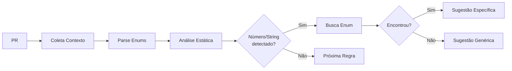

# 🎯 Detecção Inteligente de Enums

## Funcionalidade

O bot agora detecta automaticamente números mágicos e strings hardcoded que deveriam usar enums/constantes do projeto, **sugerindo exatamente qual enum usar**.

## Como Funciona

### 1. Coleta Automática de Enums

O bot busca e analisa arquivos de constantes e enums do repositório:

- **Diretórios**: `src/constants/`, `src/enumerators/`, `src/enums/`, `src/config/`
- **Formatos suportados**: `.js`, `.ts`, `.cjs`, `.mjs`
- **Padrões reconhecidos**:
  ```javascript
  // Formato 1: Export const
  export const STATUS = { ACTIVE: 1, INACTIVE: 2 };
  
  // Formato 2: Const simples
  const HttpStatus = { OK: 200, NOT_FOUND: 404 };
  
  // Formato 3: Module exports
  module.exports = { ADMIN: 'admin', USER: 'user' };
  
  // Formato 4: Object.freeze
  const UserType = Object.freeze({ ADMIN: 'admin' });
  ```

### 2. Detecção Inteligente

Durante a análise de código, a regra `constants-01` detecta:

#### Números Mágicos
```javascript
// ❌ Código com número mágico
if (vehicle.status === 1) {
  // ...
}

// ✅ Sugestão específica do bot
// "Use o enum VehicleStatus.ACTIVE ao invés do número 1"
// "Importe e use: VehicleStatus.ACTIVE"
// "Definido em: src/enumerators/vehicle-status.js"
```

#### Strings Hardcoded
```javascript
// ❌ Código com string hardcoded
if (user.type === 'admin') {
  // ...
}

// ✅ Sugestão específica do bot
// "Use o enum UserType.ADMIN ao invés do string 'admin'"
// "Importe e use: UserType.ADMIN"
// "Definido em: src/constants/user-types.js"
```

#### HTTP Status Codes
```javascript
// ❌ Código com status code hardcoded
return res.status(404).json({ error: 'Not found' });

// ✅ Sugestão específica do bot
// "Use o enum HttpStatus.NOT_FOUND ao invés do número 404"
// "Importe e use: HttpStatus.NOT_FOUND"
// "Definido em: src/enumerators/http-status.js"
```

### 3. Múltiplas Correspondências

Se um valor aparecer em múltiplos enums:

```javascript
// ❌ Código
if (status === 1) {
  // ...
}

// ✅ Sugestão
// "O número 1 pode ser substituído por enum. 2 opções encontradas:"
// "  - VehicleStatus.ACTIVE (src/enumerators/vehicle-status.js)"
// "  - OrderStatus.PENDING (src/enumerators/order-status.js)"
```

## Benefícios

### 🎯 Precisão
- Sugestões **contextualizadas** com o projeto real
- Indica **exatamente qual enum usar**
- Mostra o **arquivo fonte** da constante

### 🚀 Produtividade
- Desenvolvedores não precisam procurar manualmente
- Reduz revisões manuais
- Padroniza o uso de constantes

### 📚 Aprendizado
- Novos membros descobrem os enums do projeto
- Documentação viva do código
- Reforça boas práticas

## Exemplo de Review

### Código Analisado
```javascript
// src/controllers/vehicle-controller.js
export default class VehicleController {
  async update(req, res) {
    const { id, status } = req.body;
    
    if (status === 1) {
      await Vehicle.update({ status: 1 }, { where: { id } });
      return res.status(200).json({ success: true });
    }
    
    if (status === 2) {
      return res.status(400).json({ error: 'Invalid status' });
    }
    
    return res.status(404).json({ error: 'Not found' });
  }
}
```

### Issues Detectadas

#### Issue 1: Linha ~5
**[warning] constants-01**
> Use o enum VehicleStatus.ACTIVE ao invés do número 1

**Sugestão:**
```
Importe e use: VehicleStatus.ACTIVE
Definido em: src/enumerators/vehicle-status.js
```

#### Issue 2: Linha ~6
**[warning] constants-01**
> Use o enum VehicleStatus.ACTIVE ao invés do número 1

**Sugestão:**
```
Importe e use: VehicleStatus.ACTIVE
Definido em: src/enumerators/vehicle-status.js
```

#### Issue 3: Linha ~7
**[warning] constants-01**
> Use o enum HttpStatus.OK ao invés do número 200

**Sugestão:**
```
Importe e use: HttpStatus.OK
Definido em: src/enumerators/http-status.js
```

#### Issue 4: Linha ~10
**[warning] constants-01**
> Use o enum VehicleStatus.INACTIVE ao invés do número 2

**Sugestão:**
```
Importe e use: VehicleStatus.INACTIVE
Definido em: src/enumerators/vehicle-status.js
```

#### Issue 5: Linha ~11
**[warning] constants-01**
> Use o enum HttpStatus.BAD_REQUEST ao invés do número 400

**Sugestão:**
```
Importe e use: HttpStatus.BAD_REQUEST
Definido em: src/enumerators/http-status.js
```

#### Issue 6: Linha ~14
**[warning] constants-01**
> Use o enum HttpStatus.NOT_FOUND ao invés do número 404

**Sugestão:**
```
Importe e use: HttpStatus.NOT_FOUND
Definido em: src/enumerators/http-status.js
```

### Código Corrigido
```javascript
// src/controllers/vehicle-controller.js
import VehicleStatus from '../enumerators/vehicle-status.js';
import HttpStatus from '../enumerators/http-status.js';

export default class VehicleController {
  async update(req, res) {
    const { id, status } = req.body;
    
    if (status === VehicleStatus.ACTIVE) {
      await Vehicle.update({ status: VehicleStatus.ACTIVE }, { where: { id } });
      return res.status(HttpStatus.OK).json({ success: true });
    }
    
    if (status === VehicleStatus.INACTIVE) {
      return res.status(HttpStatus.BAD_REQUEST).json({ error: 'Invalid status' });
    }
    
    return res.status(HttpStatus.NOT_FOUND).json({ error: 'Not found' });
  }
}
```

## Configuração

A funcionalidade é **ativada automaticamente** quando:
1. O repositório possui arquivos de enums/constantes nos diretórios padrão
2. A análise estática está habilitada (padrão)

Não requer configuração adicional! 🎉

## Exclusões

A regra **não alerta** para:
- Valores comuns: `0`, `1`, `-1` (contexto-dependente)
- Strings com espaços ou pontuação (provavelmente textos para usuário)
- Strings muito curtas (1 caractere)

## Arquitetura

### Módulos

1. **`enum-matcher.js`**: Parser de arquivos de enums e matching de valores
2. **`code-analyzer.js`**: Integração com o sistema de regras
3. **`rules.js`**: Regra `constants-01` aprimorada
4. **`project-context.js`**: Coleta de constantes do repositório

### Fluxo



## Teste Manual

Execute o script de teste:

```bash
node test-enum-matcher.js
```

Saída esperada:
```
🧪 Testando EnumMatcher
═══════════════════════════════════════════════════════════════
📊 Estatísticas:
   - 3 enum(s) carregado(s)
   - 15 valor(es) total
   - Enums: VehicleStatus, HttpStatus, UserType
```

## Roadmap

Melhorias futuras:
- [ ] Suporte para TypeScript enums nativos
- [ ] Detecção de valores em switch/case
- [ ] Cache de enums entre execuções
- [ ] Sugestão de criação de novo enum quando não existe
- [ ] Integração com ESLint para validação em tempo real

---

💡 **Dica**: Combine com análise de IA para feedback ainda mais contextualizado!
